# The 99 Names of Allah

You can visit the live site here: [The 99 Names of Allah](https://sascha-netizen.github.io/99-names-of-allah/)

## Project Abstract

As a practising Muslim and teacher, I wanted to create an educational website about a core Islamic theme. I chose the 99 Names of Allah, since they are central to Islamic belief.  

Learning 99 names or attributes in isolation can be overwhelming, which is why I thought a game or interactive website would be the best way to teach both Muslims and non-Muslims about this fundamental aspect of the faith.  

From my work as a secondary school teacher, I know that learning new content in context is the most effective way to teach. Accordingly, I decided to code a memory game that combines the essentials of a JavaScript student project, elements of my faith, and educational content in one interactive application.

## 1. Background Information

When I started planning this project, I had several goals in mind.  

Firstly, I wanted to code a memory game primarily for educational purposes rather than for competing for a high score. Most areas of life are fiercely competitive, and I deliberately chose to focus on learning rather than competition.  

Secondly, I wanted users to have a choice between different difficulty levels, so they can select easy, medium, or challenging modes.  

Thirdly, I aimed to create a long-term and sustainable learning experience by including new pairs of names in each round, whether users press the level buttons on the landing page or use the reset button underneath each game table. Sound effects were also added to enhance the user experience and keep players engaged.  

Fourthly, I wanted a context- and culture-specific design, which is why I chose a Kaaba-inspired black and gold theme, reminiscent of the holiest site in Islam and the cloth draped over it (the Kiswah).

## 2. Purpose, Goals and User Information

### Purpose:
'The 99 Names of Allah' is an educational web application designed to help users learn the names and attributes of Allah in Islam through an interactive memory game. The project combines user-focussed design with educational content, providing a culturally respectful and visually appealing interface. By integrating gamification techniques, this project aims to create an engaging, long-term learning experience for users of different ages and backgrounds, including both Muslims and non-Muslims.

### Primary Goals:
Teach the 99 Names of Allah and their meanings in an interactive, memorable way using a card-matching memory game.

Offer multiple difficulty levels (easy, medium, challenging) to accommodate users with different familiarity levels or learning goals.

Provide a visually and culturally contextualised design inspired by Islamic aesthetics, including Kaaba-like black-and-gold colours and subtle references to the Kiswah, enhancing user immersion.

Support sustainable learning by randomising name pairs in each round and providing sound effects to reinforce engagement and enjoyment.

### Secondary Goals:
Demonstrate technical competence in HTML, CSS, and JavaScript, integrating real-world web development practices for interactive educational content.

Explore gamification as a pedagogical tool, showing how memory games can enhance both cognitive skills and religious education.

Provide a resource that teachers, parents, and self-learners can use for structured or informal study of Islamic culture.

### User Stories (must have):
As a Muslim learner, I want to memorise the 99 Names of Allah with their meanings so that I can deepen my knowledge and spiritual practice.

As a teacher, I want an interactive tool that presents the 99 Names of Allah in a meaningful and structured way so that I can enhance my students' understanding and retention.

As a non-Muslim learner, I want to explore the 99 Names of Allah and their meanings in context so that I can gain insight into Islamic faith and culture.

### User Story (should have):
As a parent, I want my child to practise the 99 Names of Allah through a game so that learning is enjoyable, memorable, and aligned with their faith or interest in other cultures.

### User Story (could have):
As an educational content creator, I want to implement a nicely designed and interactive memory game, so that I can adapt similar techniques for other faith-based, cultural, or educational projects.

As a web developer, I want to examine the implementation of gamification in a culturally sensitive context so that I can apply best practices to other learning applications.

## 3. Target Audience and Accessibility
Target Audience: The application is designed for a wide range of users, including Muslim learners of all ages, educators, parents, and non-Muslims interested in learning about Islamic culture. The interactive memory game appeals to both children and adults, allowing users to choose difficulty levels and pace their learning according to their comfort and prior knowledge.

Accessibility: The project emphasises inclusive design, with legible typography, high-contrast colour schemes (black-and-gold inspired), and clear visual cues. The interface is responsive, ensuring usability across desktops, tablets, and mobile devices. Sound effects and visual feedback support different learning preferences, while descriptive text ensures that users with limited prior knowledge can understand the content without confusion.

Cultural Sensitivity: All content and design elements have been chosen with respect for Islamic tradition and values. The application avoids unnecessary distractions or competitive gamification elements, focussing instead on education, reflection, and long-term retention of knowledge.

## 4. Design

For this project, I wanted an immediately recognisable design. I looked through old photos I took when I was working in Egypt (mosques, madrasas, and other Islamic structures on [Al Mu'izz Street](https://en.wikipedia.org/wiki/Al-Mu%27izz_Street), for instance). However, none of these convinced me, which is why I kept searching. Islam's holiest sites in present-day Saudi Arabia — [Prophet Muhammad's Mosque](https://en.wikipedia.org/wiki/Prophet%27s_Mosque) in Medina and the [Kaaba](https://en.wikipedia.org/wiki/Kaaba) in Mecca — were my next points of reference. I then quickly decided to use the Kaaba-like black-and-gold design as my framework, not only because it is universally recognised by Muslims but also because I wanted to adhere to the Islamic principle of *tawhid*, or the oneness of Allah. A direct reference to the Prophet Muhammad's Mosque might have been misinterpreted by non-Muslims.

### The Final Colour Palette:

## Colour Palette

| Colour Name      | Hex Code  | Usage Example                               |
|-----------------|-----------|--------------------------------------------|
| Primary Colour   | `#1A1A1A` | Body background, sidebars, modals          |
| Secondary Colour | `#2A2A2A` | Card backs, container backgrounds          |
| Text Colour      | `#999999` | Paragraphs, span descriptions, footer text |
| Headline / Accent| `#FFB700` | Headings, important highlights, navbar & footer |

## Typography:

I experimented with different fonts that fit together and were pleasing to the eye. As was the case in my first milestone project, I was led by trial and error, finally settling on [Merriweather](https://fonts.google.com/specimen/Merriweather) for headlines and [Raleway](https://fonts.google.com/specimen/Raleway) for text.

## Images

I downloaded the favicon from [flaticon.com](https://www.flaticon.com/free-icon/koran_384372?term=islam&page=1&position=9&origin=search&related_id=384372).

The background image of the Kaaba and the Kiswah are taken from [pexels.com](https://www.pexels.com/).

## Wireframes

  
Landing Page (Mobile Screens)

  

 

  
Game Table (Mobile Screens)

  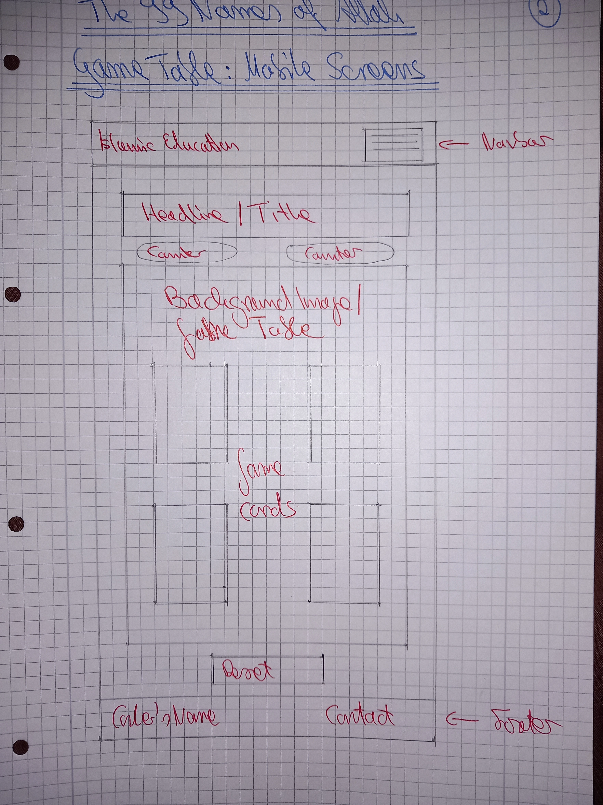

 

  
Landing Page (Desktop)

  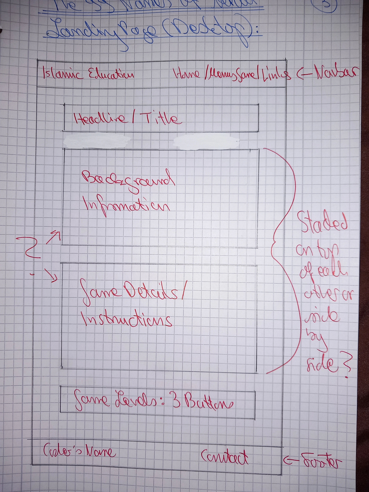

 

  
Game Table (Desktop)

  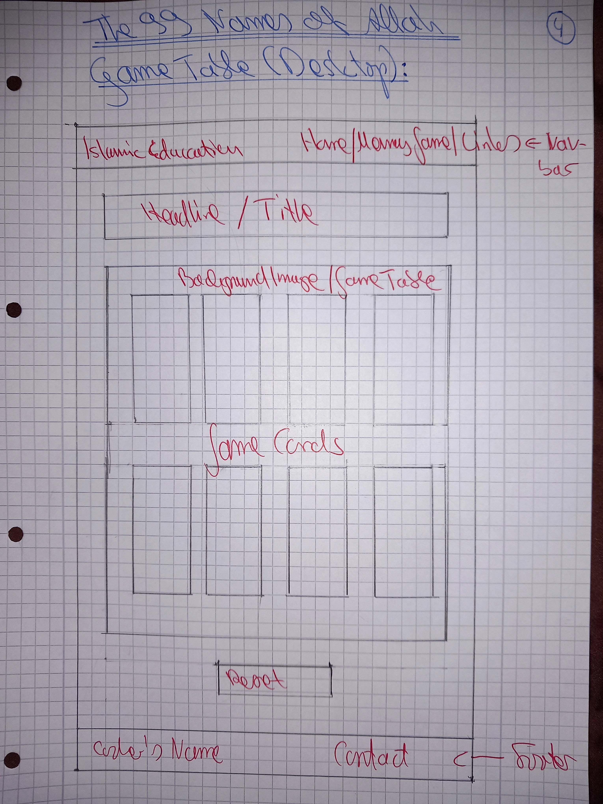

 

## 5. Website Features

Here is an overview of general features that appear on each page:

<table style="border-collapse: separate; border-spacing: 0 20px;">
  <thead>
    <tr>
      <th>Website Feature</th>
      <th>Display / Implementation</th>
    </tr>
  </thead>
  <tbody>
    <tr>
      <td>This is the footer on small screens (tablet and smaller):</td>
      <td></td>
    </tr>
    <tr>
      <td>This is the footer on big screens:</td>
      <td></td>
    </tr>
    <tr>
      <td>This is the navbar on small screens (tablet and smaller):</td>
      <td></td>
    </tr>
    <tr>
      <td>This is the navbar on big screens:</td>
      <td></td>
    </tr>
    <tr>
      <td>This is the contact pop-up modal which is available in the footer on each page:</td>
      <td></td>
    </tr>
  </tbody>
</table>

  

## Landing Page ##

The first section of the landing page consists of the headline in both Arabic and English, as well as a short decription of the what users can expect: 

 

The second section of the landing page provides background information and instructions for playing the memory game:

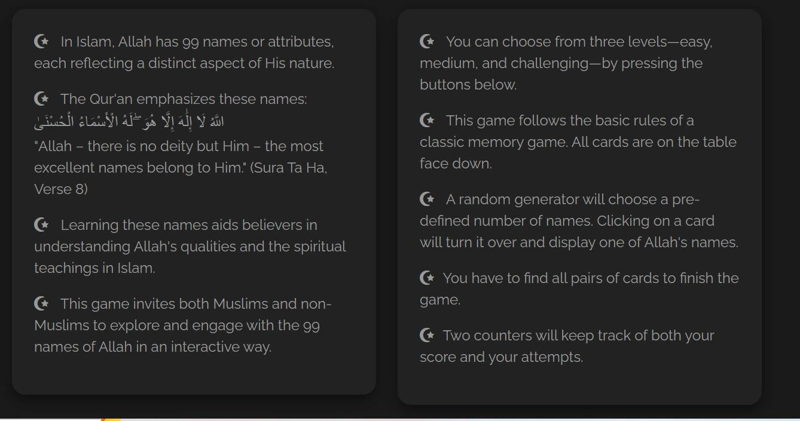

 

The third section of the landing page offers user the choice between three different game levels:

  

## Game Table ##

The first section of the game-table page consists of the headline, an encouraging call to action and the required counters for both attempts and matches:

 

The next section is the game table proper with the memory cards(there are three levels/options). The background image displays Masjed Al Haram in Mecca and the Kaaba:

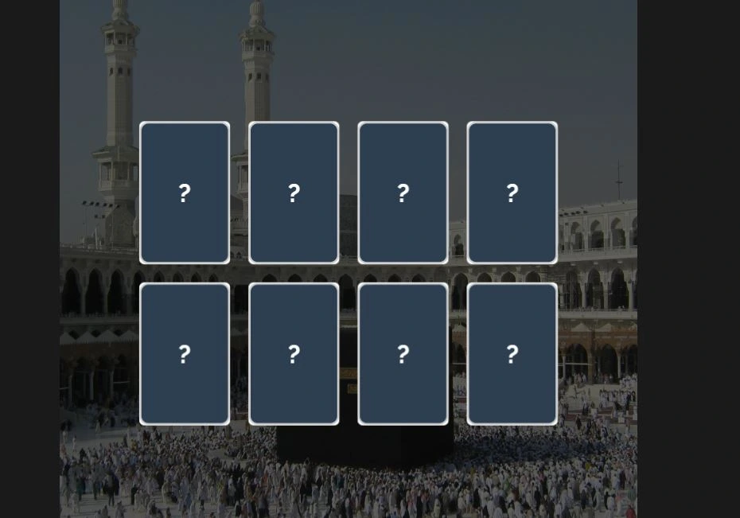

 

The final section on the game-table page offers users a reset option, which triggers a re-shuffling of cards with new names to play with:

  

## Links ##

The third page provides some pertinent links with information about the game's central theme (the 99 names of Allah): 

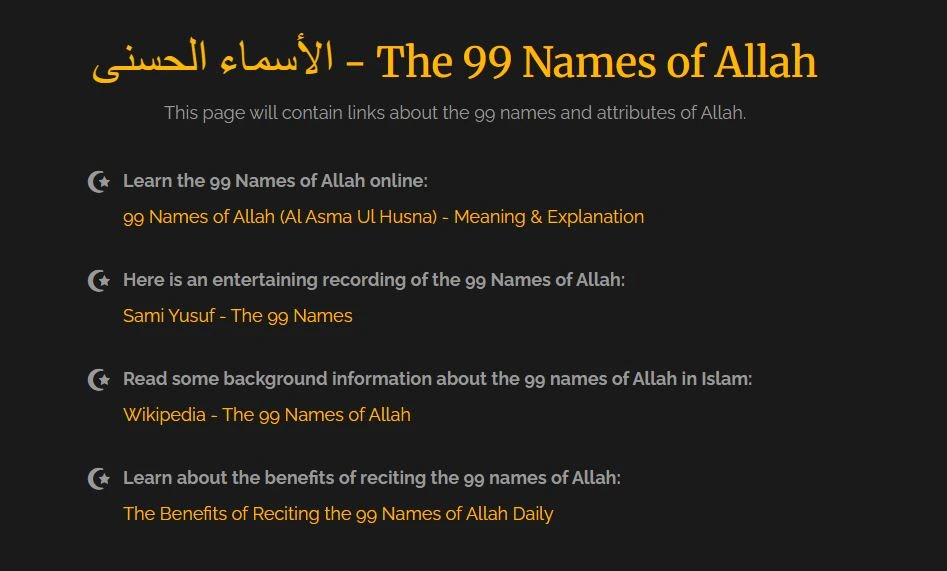

  

## Error Page ##

The custom 404 error page guides users back to the homepage with a culturally consistent black-and-gold design that matches the rest of the site.

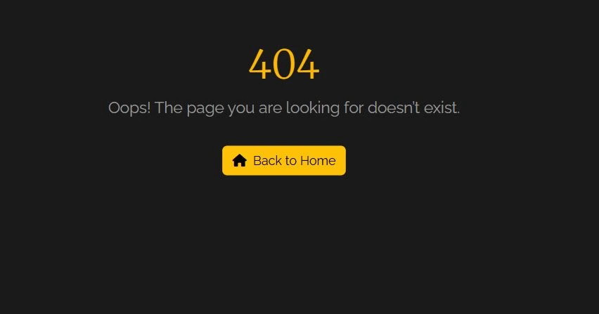

  

## 6. Future Enhancements and Implementations

I would like to expand this project into a more comprehensive learning platform that goes beyond a single memory game. For instance, quizzes, flashcards, or storytelling modules could deepen user engagement with the 99 Names of Allah and provide learners with multiple ways to practise and review the content.

Since Islamic education often benefits from shared practice, a multiplayer or collaborative mode could allow families, classrooms, or study groups to engage with the game together. This would highlight the communal aspect of learning while still keeping the project focused on accessibility and inclusivity.

Additional language options (such as Arabic, English, German, and Turkish) would also strengthen the platform, making it useful for learners from different backgrounds while reflecting the multilingual reality of Muslim communities worldwide.

 

## 7. Deployment 

The memory game "The 99 Names of Allah" is deployed on GitHub pages, and the live link is [here](https://sascha-netizen.github.io/99-names-of-allah/).

In order to deploy the site, please follow these these steps:

1. Log in (or create an account) on GitHub.
2. Navigate to the project’s repository [here](https://github.com/Sascha-netizen/99-names-of-allah).
3. Open the **Settings** tab.
4. In the left-hand sidebar, click **Pages**.
5. From the **Branch** dropdown, choose the **main** branch and click **Save**.
6. Your site will now be deployed. Please note that it might take a few moments for the site to become live.
 

## Forking the Repository

1. Navigate to the repository on GitHub: https://github.com/Sascha-netizen/99-names-of-allah
2. Click the Fork button in the top-right corner.
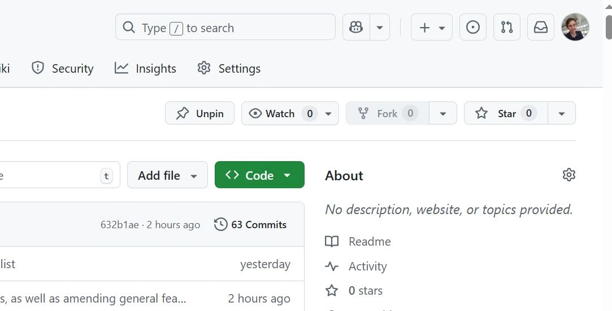

3. From the dropdown menu, choose the desired **owner** for the forked repository.
4. Click **Create fork** to complete the process.
 

## Cloning the Repository

1. Navigate to the repository on GitHub: https://github.com/Sascha-netizen/99-names-of-allah
2. Click the Code button located above the list of files.  
3. Copy the repository link using one of these options:  
   - **HTTPS**: Under the HTTPS tab, click the copy icon.  
   - **SSH**: Select the SSH tab (for SSH keys) and click the copy icon.  
   - **GitHub CLI**: Choose GitHub CLI and copy the provided command. 
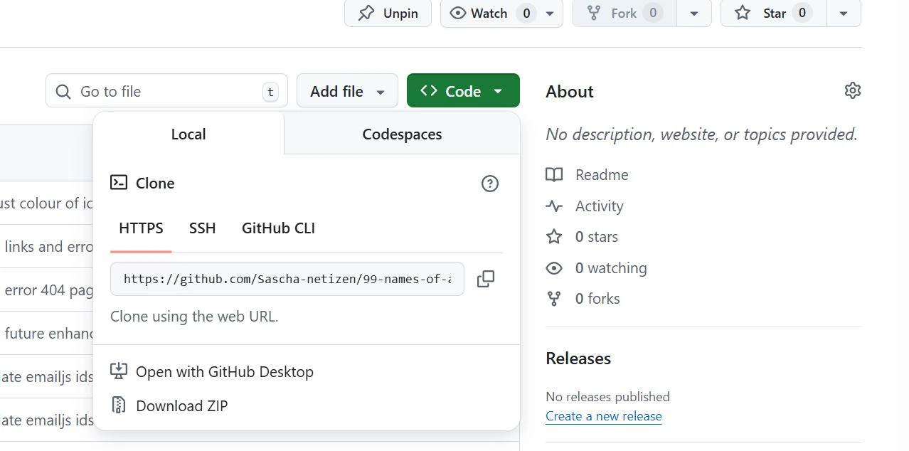
4. Open your terminal or command prompt.
5. Navigate to the folder where you want to save the project.
6. Run the following command: 'git clone' and replace <URL> with the link you copied:
7. Press Enter. Your local clone will be created.
  

## 8. Bugs

<table style="border-collapse: separate; border-spacing: 0 10px;">
  <thead>
    <tr>
      <th>Bug</th>
      <th>Fix</th>
    </tr>
  </thead>
  <tbody>
    <tr>
      <td>Overlay over background image was too dark initially.</td>
      <td>Added CSS code to brighten the shadow/overlay.</td>
    </tr>
    <tr>
      <td>Both the feedback.js file and the 'Send Feedback' pop-up window seemed to work but no emails came through emailjs.</td>
      <td>Double-checked account and email IDs and debugged using the console.</td>
    </tr>
    <tr>
      <td>Game cards were off the table and not centred.</td>
      <td>Added and adjusted CSS code to centre cards on the game table.</td>
    </tr>
    <tr>
      <td>The reset button worked, but I needed to signal to the user that the game was being reset.</td>
      <td>Added visual and sound effects to illustrate the game reset.</td>
    </tr>
  </tbody>
</table>
  

## 9. Testing

### Manual Testing

### Landing Page:

<table style="border-collapse: separate; border-spacing: 0 10px;">
  <thead>
    <tr>
      <th>Feature</th>
      <th>Expected Functionality</th>
      <th>Result</th>
    </tr>
  </thead>
  <tbody>
    <tr>
      <td>Islamic Education</td>
      <td>Clicking on Islamic Education in the navbar takes users back to the landing page.</td>
      <td>✅</td>
    </tr>
    <tr>
      <td>Navigation Bar</td>
      <td>On small screens, the bar collapses into a burger/bars icon.</td>
      <td>✅</td>
    </tr>
    <tr>
      <td>Burger/Bars Icon</td>
      <td>A dropdown menu appears when clicked.</td>
      <td>✅</td>
    </tr>
    <tr>
      <td>Navigation Buttons (Home, Memory Game, Links)</td>
      <td>Clicking on the respective button takes users to the corresponding page. The Memory Game button loads the default option (easy level).</td>
      <td>✅</td>
    </tr>
    <tr>
      <td>Navigation Buttons: Hover Effect</td>
      <td>Buttons highlight when hovered over.</td>
      <td>✅</td>
    </tr>
    <tr>
      <td>Background and Instructions Sections</td>
      <td>A box shadow appears as the CSS transform/translate lifts each section slightly.</td>
      <td>✅</td>
    </tr>
    <tr>
      <td>Game Level Buttons</td>
      <td>Buttons highlight on hover and navigate users to easy, medium, or challenging levels.</td>
      <td>✅</td>
    </tr>
    <tr>
      <td>Send Feedback in Footer</td>
      <td>Pop-up modal appears allowing users to send an email.</td>
      <td>✅</td>
    </tr>
  </tbody>
</table>
  

### Game Table

<table style="border-collapse: separate; border-spacing: 0 10px;">
  <thead>
    <tr>
      <th>Feature</th>
      <th>Expected Functionality</th>
      <th>Result</th>
    </tr>
  </thead>
  <tbody>
    <tr>
      <td>Islamic Education</td>
      <td>Clicking on "Islamic Education" in the navbar takes users back to the landing page.</td>
      <td>✅</td>
    </tr>
    <tr>
      <td>Navigation Bar</td>
      <td>On small screens, the navigation bar collapses into a burger/bars icon.</td>
      <td>✅</td>
    </tr>
    <tr>
      <td>Navigation Buttons (Home, Memory Game, Links)</td>
      <td>Clicking on each button takes users to the corresponding page. The Memory Game button loads the default option (easy level).</td>
      <td>✅</td>
    </tr>
    <tr>
      <td>Navigation Buttons: Hover Effect</td>
      <td>Buttons highlight when hovered over.</td>
      <td>✅</td>
    </tr>
    <tr>
      <td>Counters</td>
      <td>The counters for attempts and matches increment correctly.</td>
      <td>✅</td>
    </tr>
    <tr>
      <td>Game Cards</td>
      <td>The game cards (4, 6, and 8 pairs) flip when clicked and remain open if matched. They flip back if there is no match.</td>
      <td>✅</td>
    </tr>
    <tr>
      <td>Reset Button</td>
      <td>The reset button triggers visual and sound effects to indicate a reshuffle of cards and the start of a new game.</td>
      <td>✅</td>
    </tr>
    <tr>
      <td>Send Feedback in Footer</td>
      <td>A pop-up modal appears, allowing users to send an email.</td>
      <td>✅</td>
    </tr>
  </tbody>
</table>
  

### Links and Error Pages

<table style="border-collapse: separate; border-spacing: 0 10px;">
  <thead>
    <tr>
      <th>Feature</th>
      <th>Expected Functionality</th>
      <th>Result</th>
    </tr>
  </thead>
  <tbody>
    <tr>
      <td>Navigation Bar</td>
      <td>The navigation bar functions consistently on both the landing and game-table pages.</td>
      <td>✅</td>
    </tr>
    <tr>
      <td>Links</td>
      <td>All links open in new tabs.</td>
      <td>✅</td>
    </tr>
    <tr>
      <td>Send Feedback in Footer</td>
      <td>A pop-up modal appears, allowing users to send an email.</td>
      <td>✅</td>
    </tr>
    <tr>
      <td>Error Page</td>
      <td>The back-to-home button takes users back to the landing page.</td>
      <td>✅</td>
    </tr>
  </tbody>
</table>
  

## Testing the User Stories

<table style="border-collapse: separate; border-spacing: 0 10px; width: 100%;">
  <thead>
    <tr>
      <th>User Story</th>
      <th>Homepage Feature</th>
      <th>Result & Feature fulfilling user story</th>
    </tr>
  </thead>
  <tbody>
    <tr>
      <td>User Story #1</td>
      <td>As a Muslim learner, I want to memorise the 99 Names of Allah with their meanings so that I can deepen my knowledge and spiritual practice.</td>
      <td>✅ (Memory Game and links provided).</td>
    </tr>
    <tr>
      <td>User Story #2</td>
      <td>As a teacher, I want an interactive tool that presents the 99 Names of Allah in a meaningful and structured way so that I can enhance my students' understanding and retention.</td>
      <td>✅ (Memory Game; gamification as a meaningful learning strategy).</td>
    </tr>
    <tr>
      <td>User Story #3</td>
      <td>As a non-Muslim learner, I want to explore the 99 Names of Allah and their meanings in context so that I can gain insight into Islamic faith and culture.</td>
      <td>✅ (Memory Game and links provided).</td>
    </tr>
    <tr>
      <td>User Story #4</td>
      <td>As a parent, I want my child to practise the 99 Names of Allah through a game so that learning is enjoyable, memorable, and aligned with their faith and interest in other cultures.</td>
      <td>✅ (Memory Game, links provided, and culturally sensitive design of the web page).</td>
    </tr>
    <tr>
      <td>User Story #5</td>
      <td>As an educational content creator, I want to implement a well-designed and interactive memory game so that I can adapt similar techniques for other faith-based, cultural, or educational projects.</td>
      <td>✅ (Memory Game, links, and culturally sensitive design can be adapted to other contexts).</td>
    </tr>
    <tr>
      <td>User Story #6</td>
      <td>As a web developer, I want to examine the implementation of gamification in a culturally sensitive context so that I can apply best practices to other learning applications.</td>
      <td>✅ (Memory Game, links, and culturally sensitive design).</td>
    </tr>
  </tbody>
</table>
  

## W3C Validator Testing and Quality Assurance:

W3C HTML Validator (Landing Page):

 

W3C HTML Validator (Game Table):

 

W3C HTML Validator (Links):

 

W3C HTML Validator (404 Page):

 

W3C CSS Validator:

 

JS Hint for testing script.js:
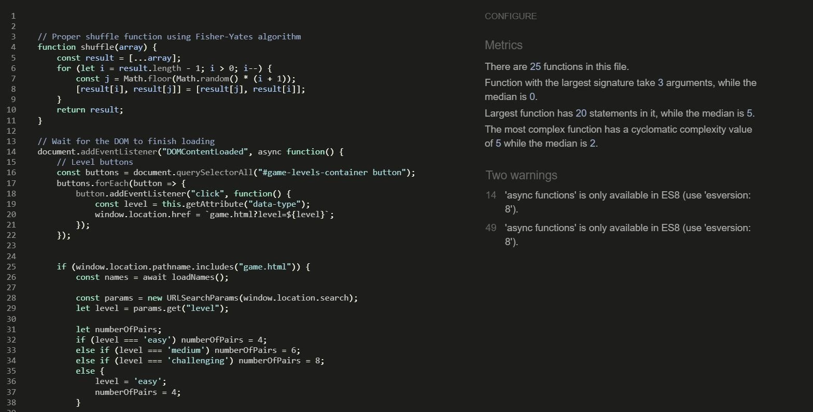
 

Esprima for alternative testing of script.js:

During development and testing, the application performed reliably, and no significant errors were detected.
 

JS Hint for testing feedback.js:
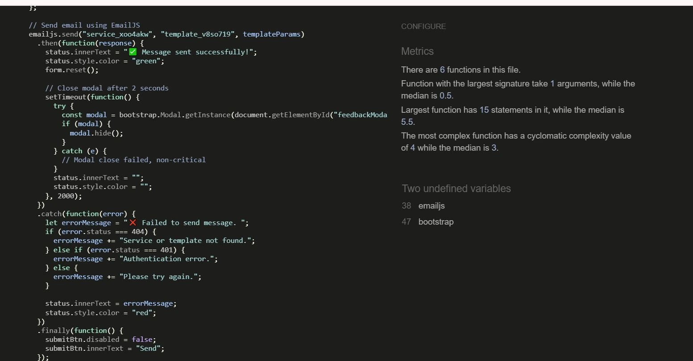
 

Esprima for alternative testing of feedback.js:
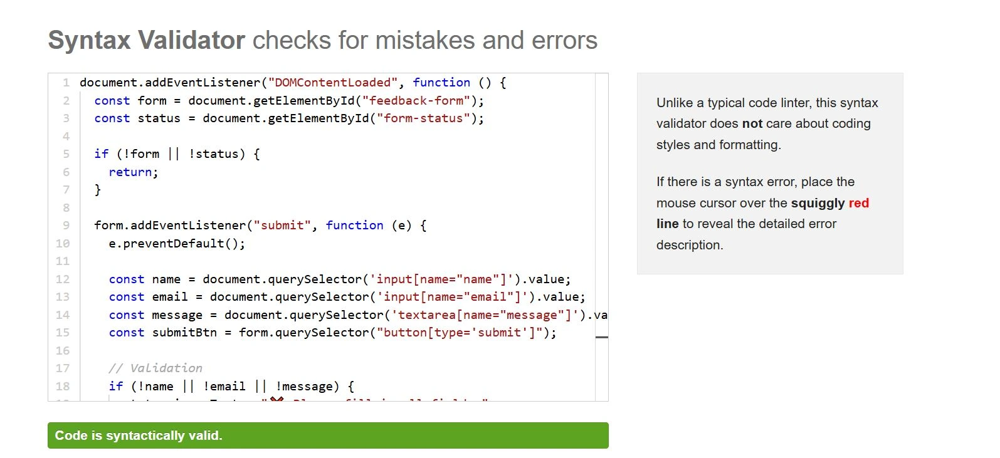
 

JSONLINT.COM for testing names.json:

  

## Lighthouse Testing

Landing Page (Mobile Screen):
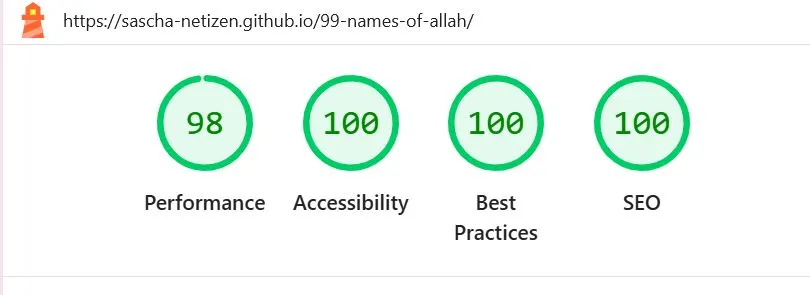
 

Landing Page (Desktop):
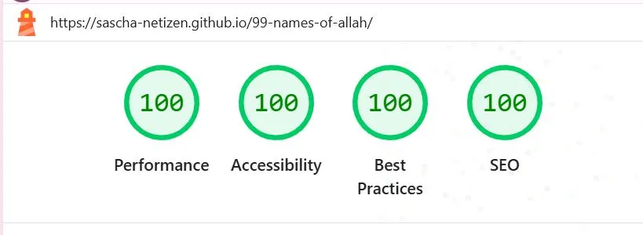
 

Game Table (Mobile Screen):
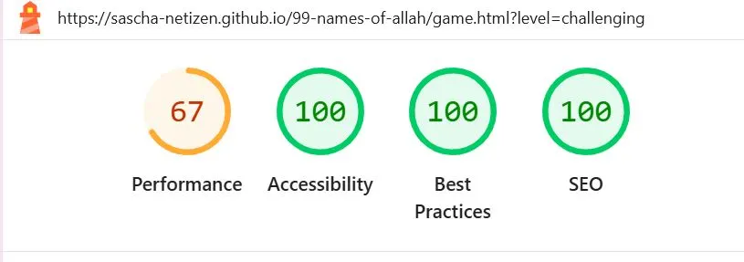
 

Game Table (Desktop):
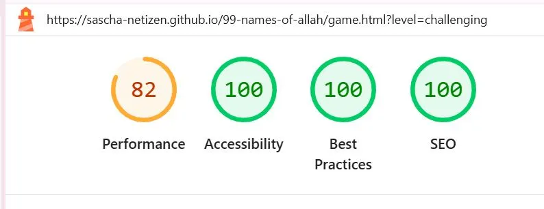
 

Links (Mobile Screen):
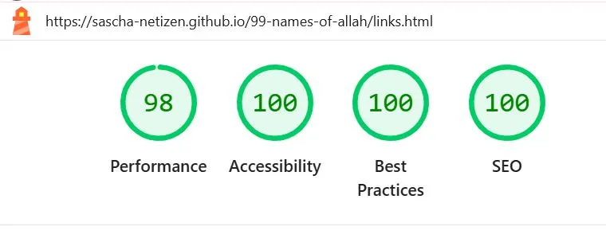
 

Links (Desktop):
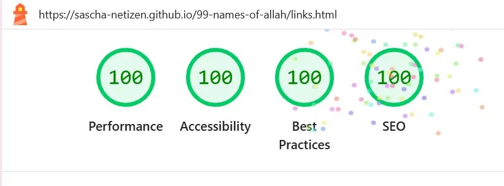
 

Error Page (Mobile Screen):
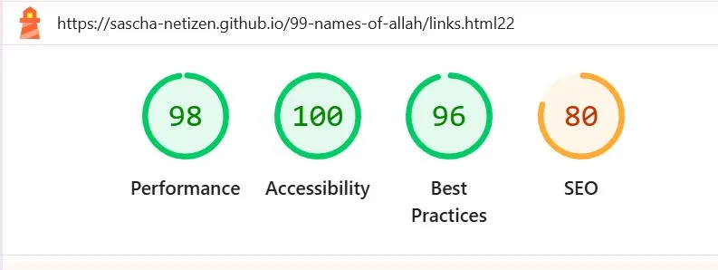
 

Error Page (Desktop):

  

## Accessibility (Wave Testing)

Landing Page:
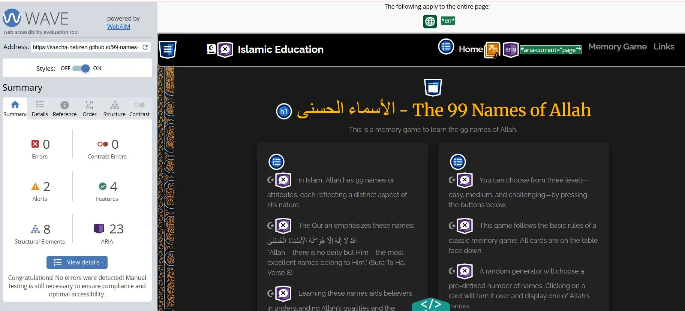
 

Game Table:
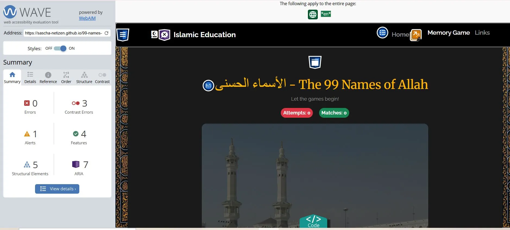
 

Links:
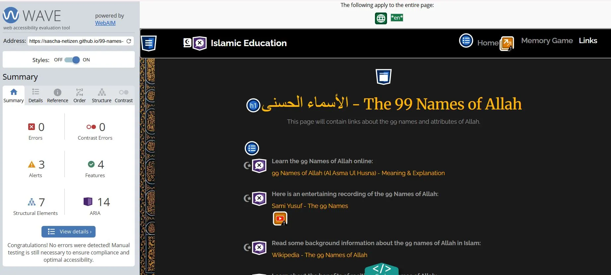
 

Error Page:
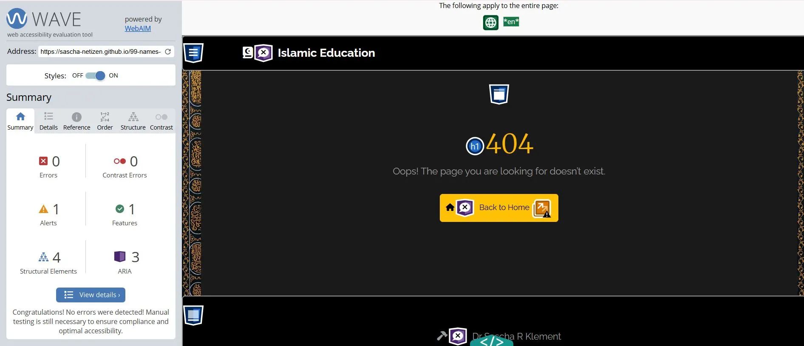
  

## Speed/Performance Testing

Performance (Mobile Screen):

 

Performance (Desktop):

  

## 10. Resources and Credits

For this project, I used...

HTML, CSS and Javascript

the Bootstrap library and Bootstrap grid (for layout, design and spacing),

VS Code as code editor,

Open AI ChatGPT (for reviewing code snippets and debugging),

photos from Pexels,

flaticon for the favicon,

coolors to generate my colour palette,

Google Fonts,

Font Awesome icons,

Am I responsive (mock up for different screen sizes),

the Boardwalk-Games lessons for using Bootsptrap grid,

the README.md example provided by [Kera Cudmore](https://github.com/kera-cudmore/readme-examples/blob/main/milestone1-readme.md).
 

Acknowledgements:
The following people's support was vital for this project:
 - Abeer ElAshry (my wife),

 - my cohort facilitator Kay_CI before her departure and my mentor Moahammed Shami for providing important information along the way, 

 - my friends and family who played the game for testing purposes, and

 - my paternal grandmother Anneliese Klement, who passed away during my work on this project.

